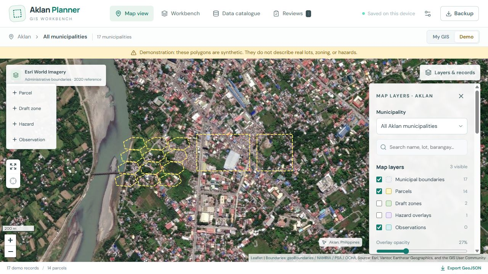
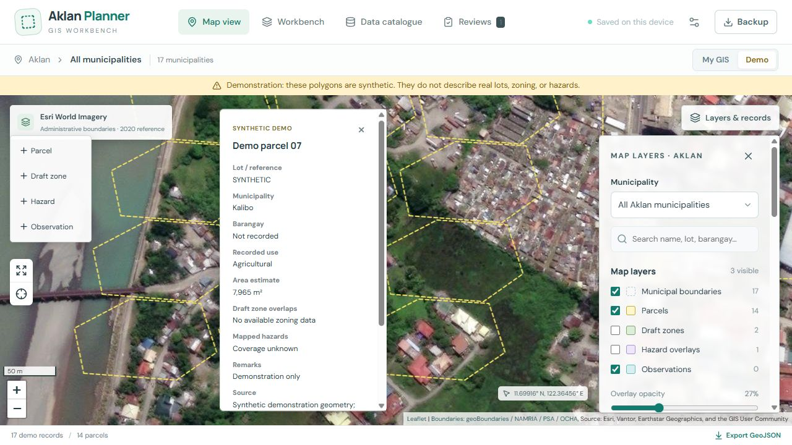

# Aklan Planner

An original GIS planning workbench for **Aklan, Philippines**, built with React, TypeScript, Leaflet, Turf, and **Esri World Imagery**. Inspect yellow parcel outlines, draw detailed boundaries, compare draft zoning and hazard overlays, and save parcel reviews with the evidence used.

The map layout is inspired by the supplied Zonify photographs. This project uses its own code and identity and is not affiliated with Zonify or West Visayas State University.

## Demo



*Imagery credit: Source: Esri, Vantor, Earthstar Geographics, and the GIS User Community. Boundaries: geoBoundaries / NAMRIA / PSA / OCHA, 2020 reference. Outlined demo lots are synthetic.*



Run the app locally, then click **Demo**:

1. Explore 14 synthetic parcels, including irregular boundaries with six corners. Click a lot or choose it under **Layers & records** to open its popup.
2. Select **Demo parcel 01**. Its synthetic zones split the parcel into approximately 50% Residential and 50% Agricultural; its demo flood overlap is approximately 16.7%.
3. Toggle **Draft zones** or **Hazard overlays** to see their geometry. Layer visibility affects the map; analysis uses all available records in the same workspace.
4. Choose **Inspect / review this record**, enter a reviewer and assessment, and save the review. Open **Reviews → Report** to download a printable HTML report.
5. Switch to **My GIS** to create your own records. Choose **Parcel**, click each corner, then **Finish boundary**. There is no three-corner maximum. Use **Undo last point**, **Cancel drawing**, or **Escape** before finishing. Cancelling discards the unsaved shape.

Also included: [demo GeoJSON](docs/demo.geojson), [demo workspace backup](docs/demo-workspace.json), and a [sample review report](docs/demo-review.html). The GeoJSON imports alongside existing data. Restoring the demo workspace **replaces** the current workspace, so export a backup first.

There is no public live-demo URL yet. An optional GitHub Pages workflow is included below; add the resulting URL to this section after deployment.

## Run in Visual Studio Code

Install Node.js **24 LTS** and open this project folder in VS Code. The supported minimum is Node 22.12. In the terminal:

```sh
npm ci
npm run dev
```

Open **http://127.0.0.1:5173/**. Internet access is needed for imagery; the bundled boundaries and local records do not require an external GIS server. Port 5173 is fixed to avoid silently opening a different local-storage origin. Stop the server with Ctrl+C when finished.

```sh
npm test
npm run data:verify
npm run build
npm run preview
```

Production preview opens on **http://127.0.0.1:4173/**. Browser storage is separate for each origin, including `localhost`, `127.0.0.1`, different ports, and your deployed website. Export and restore a backup when moving between them.

## Features

- Map view: large imagery map, collapsible right-hand layers/records panel, yellow lot outlines, and a closable record popup. Workbench view adds side-by-side inspection and review tools.
- Aklan province and all 17 municipalities, including island geometry; municipal filter, record search, scale, coordinates, zoom, and fit-to-Aklan.
- Draw and edit parcels, draft zones, hazard polygons, and observation areas. Store name, municipality, barangay, reference, category, source, date, verification label, and notes.
- Validate WGS84 Polygon/MultiPolygon geometry, reject self-crossing or out-of-Aklan shapes, and preview imports before adding them.
- Calculate spherical area, intersection area percentages, union-based zone coverage, and conflicts between overlapping zone polygons.
- Keep demonstration and user records separate in the map and analysis.
- Save reviews with independent parcel/overlay snapshots. Later edits or deletion of current records do not alter a saved review. Imported review calculations are rebuilt from their snapshots.
- Export GeoJSON, export/restore workspace backups, and download printable reports. Responsive map and review controls are included.

## Make your own GIS data

No LGU correspondence is required to use this version. Draw polygons directly on the satellite map, record field observations, or prepare openly licensed polygons in QGIS and import them. Keep a source and date with every record. A boundary traced from imagery is a **draft**; imagery alone cannot establish a surveyed lot, ownership, or approved zoning.

The bundled open data consists of **administrative boundaries only**, extracted from geoBoundaries' 2020-reference Philippines ADM2/ADM3 releases. No official Aklan parcel, zoning, flood, population-density, or road layers are bundled. The demo zoning and flood polygons are invented examples. The app does not invent municipality ordinances or present model confidence as a legal classification.

See [DATA_LICENSES.md](DATA_LICENSES.md), [provenance.json](public/data/provenance.json), and [the GIS data guide](docs/GIS_DATA_GUIDE.md). To reproduce the bundled extraction from pinned upstream files:

```sh
npm run data:acquire
npm run data:verify
```

## Data limits and storage

This release is a **personal, device-local workbench**, suitable for a prototype and individual planning review. It has no account system, shared LGU database, central backups, or approval workflow. Records are stored in this browser's localStorage. Clearing site data removes them. Use **Backup** regularly and before changing devices.

The local limit is 500 records and 500 reviews. GeoJSON imports allow up to 500 polygon features and 10 MB; workspace backup restores allow 30 MB. Very detailed/large overlays can exceed browser storage or make geometry calculations slow. Source records, field observations, and drafts are labels; none automatically certifies a boundary or zoning decision.

Missing hazard overlap means **no overlap in the available data**, not proof of safety. Zone percentages describe mapped parcel area; they are not probabilities. Simplified administrative edges can reject a coastal sketch that requires a more detailed boundary source. Geometry estimates are not survey measurements.

If saved data fails validation, automatic saving pauses to preserve the original stored copy. Download that copy for recovery and restore a valid backup before resuming persistence.

## Esri configuration

By default the app uses the online public World Imagery MapServer through Esri Leaflet, with service attribution visible. For a configured ArcGIS basemap account, copy `.env.example` to `.env.local` and set `VITE_ARCGIS_API_KEY`. The keyed mode uses the authenticated World Imagery basemap service.

A Vite browser key is visible to visitors. Scope it to basemap access and restrict its referrers to your app URLs. Do not commit private credentials. Keep Esri/provider credits visible and review current account and imagery terms for your deployment. Imagery is not distributed under this repository's MIT license or bundled for offline use.

## Upload to GitHub

Upload the **contents of this project folder** as the repository root, including source, public data, docs, package files, license notices, and `.github` workflows. Do not upload `node_modules`, `dist`, `.env.local`, private GIS records, or workspace backups containing personal evidence. The `.gitignore` covers these working directories; inspect your staged changes before publishing.

For a new, empty GitHub repository:

```sh
git init -b main
git add .
git commit -m "Build Aklan Planner GIS workbench"
git remote add origin https://github.com/YOUR_USERNAME/YOUR_REPOSITORY.git
git push -u origin main
```

Replace both placeholders. If you cloned an existing repository, use its existing Git history and remote instead. GitHub's browser upload can omit hidden directories; use Git/VS Code when including the workflows.

CI runs tests, checks the bundled data, and builds on pushes and pull requests. To publish the optional static demo: set **Settings → Pages → Source → GitHub Actions**, then run **Deploy GitHub Pages** from the Actions tab. The workflow sets the repository base path automatically. It publishes code and bundled demo/open data; browser-created records stay on the visitor's device. For keyed imagery, optionally set repository variable `ARCGIS_BASEMAP_KEY` to a referrer-restricted public browser key.

## Project structure and checks

| Path | Purpose |
| --- | --- |
| `src/MapView.tsx`, `src/map-layout.css` | Satellite map, drawing controls, parcel popup, and map-first presentation |
| `src/App.tsx` | Records, import preview, editor, catalogue, reviews, and workspace controls |
| `src/gis.ts` | Geometry validation, Aklan containment, area/overlap analysis, demo generation |
| `src/storage.ts`, `src/report.ts` | Validated backups, persistence, and escaped HTML reports |
| `public/data/` | Bundled boundaries and provenance/checksums |
| `scripts/`, `tests/` | Reproducible boundary acquisition, data verification, and GIS tests |

See [testing notes](docs/TESTING.md) for automated checks and browser verification. Builds are checked; future edits should rerun the checks. The software is provided under [MIT](LICENSE), with separate data/imagery terms in [DATA_LICENSES.md](DATA_LICENSES.md).
